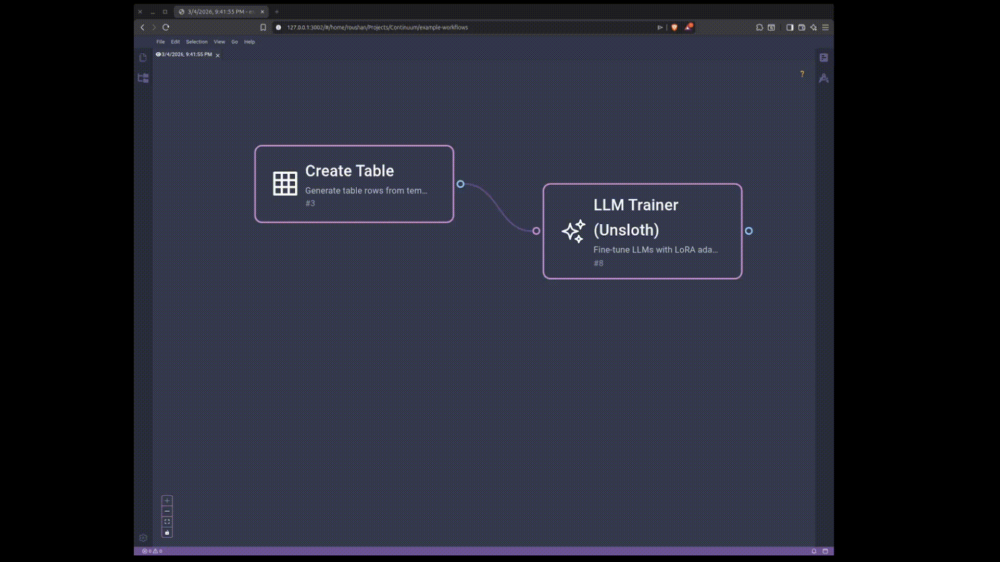

<p align="center">
  
</p>

<h1 align="center">Project Continuum</h1>

<p align="center">
  <strong>Visual workflows that actually run — and survive.</strong><br/>
  Inspired by KNIME. Made for the cloud. Built to never die.
</p>

<p align="center">
  <a href="#-quick-start"></a>
  <a href="#-how-it-works"></a>
  <a href="#-contribute"></a>
  <a href="LICENSE"></a>
</p>

<p align="center">
  <em>No desktop. No install. Just resilient workflows, in your browser.</em>
</p>

---

## 🎬 See It In Action

<p align="center">
  
</p>

<p align="center"><em>↑ A real workflow: streaming sensor data → anomaly detection → alert — all drag-and-drop.</em></p>

---

## 💡 The Idea

Start with a drop.
One node. Two.
Transform. Branch. Loop.

Each step tiny.
But at the end — it's a river.
A request turned system.
A click turned outcome.

> **Most tools look good. Then break.**
> We want graphs that keep running —
> even if Kafka dies, even if S3 lags, even if your code crashes.

---

## ✨ Features at a Glance

| | Feature | Description |
|---|---------|-------------|
| 🎨 | **Browser-Native Canvas** | Drag-and-drop workflow editor — real IDE feel, zero install |
| 🔁 | **Indestructible Execution** | Workflows survive crashes, restarts, and infrastructure failures |
| ⚡ | **Live Streaming Updates** | Watch your workflow execute step-by-step in real time |
| 📊 | **Columnar Data Passing** | Parquet tables between nodes — fast, query-ready |
| 🧪 | **AI / ML Ready** | Train models with Unsloth, run inference, all inside your flow |
| 🐳 | **Self-Hostable** | Docker Compose up and you're running |

---

## 🧱 How It Works

```
┌─────────────────────────────────────────────────────┐
│                    BROWSER                           │
│   Eclipse Theia + React Flow (drag & drop canvas)   │
└──────────────────────┬──────────────────────────────┘
                       │ WebSocket / REST
                       ▼
┌─────────────────────────────────────────────────────┐
│              BACKEND (Kotlin + Spring Boot)          │
│         Typed, clean, contract-safe API server       │
└──────┬──────────────────────────────┬───────────────┘
       │                              │
       ▼                              ▼
┌──────────────┐          ┌───────────────────────┐
│   Temporal   │          │   Kafka → MQTT (WS)   │
│  Durable     │          │   Live event stream    │
│  Execution   │          │   step-by-step updates │
└──────────────┘          └───────────────────────┘
       │
       ▼
┌─────────────────────────────────────────────────────┐
│         Storage: AWS S3 / MinIO (local dev)         │
│         Format: Apache Parquet — columnar, fast     │
└─────────────────────────────────────────────────────┘
```

### The Stack

| Layer | Technology | Why |
|-------|-----------|-----|
| **Canvas** | [Eclipse Theia](https://theia-ide.org/) + [React Flow](https://reactflow.dev/) | Full IDE experience in the browser |
| **Engine** | [Temporal](https://temporal.io) | Durable execution, auto-retry, infinite scale |
| **Events** | Kafka → MQTT over WebSockets | Real-time step-by-step workflow updates |
| **Data** | Apache Parquet | Fast, columnar, query-ready inter-node data |
| **Storage** | AWS S3 / MinIO | Open, portable, no vendor lock-in |
| **Backend** | Kotlin + Spring Boot | Type-safe, clean, battle-tested |
| **Resilience** | Temporal | Fails? Retries. Crashes? Recovers. Forever. |
| **Flow Control** | Output `null` on a port = flow stops | Simple guard logic. Real loops coming. |

---

## 🧬 AI Training Workflows

<p align="center">
  
</p>

<p align="center"><em>↑ Fine-tune LLMs with Unsloth — right inside your workflow graph.</em></p>

---

## 🚀 Quick Start

```bash
# Clone the repo
git clone https://github.com/your-org/Continuum.git
cd Continuum

# Spin up infrastructure (Temporal, Kafka, MinIO, Mosquitto)
cd docker
docker compose up -d

# Build & run the backend
./gradlew :continuum-api-server:bootRun --args='--server.port=8080'

# (In another terminal) Build and run Message Bridge (Kafka → MQTT)
./gradlew :continuum-message-bridge:bootRun --args='--server.port=8082'

# (In another terminal) Start the worker
./gradlew :workers:continuum-base-worker:bootRun --args='--server.port=8081'

# Open the Workbench
cd continuum-frontend 
yarn install
yarn start:workbench

# Open http://localhost:3002 and start building workflows!
```

> 💡 Full setup guide coming soon. For now — explore, break things, open issues.

---

## 🗺️ Roadmap

- [x] Drag-and-drop visual workflow editor
- [x] Durable execution with Temporal
- [x] Live streaming updates via Kafka → MQTT
- [x] Parquet-based data passing between nodes
- [x] Base node library (Transform, REST, Branch, etc.)
- [x] Unsloth AI training node
- [ ] 🔁 True `while` / `for` loops with condition builder
- [ ] 🧪 More RDKit chemistry nodes
- [ ] 🤖 Full AI training node suite (Unsloth ecosystem)
- [ ] 🔌 Plugin store — Slack, Stripe, Databases, AI services
- [ ] 🐛 Visual debugger with timeline replay
- [ ] 👥 Multi-tenancy & RBAC
- [ ] 🏗️ Multi-worker support — each plugin runs its own worker, all discovered via shared registry
- [ ] 📦 Zero-config self-host with `docker compose up`

---

## 🤝 Contribute

We don't want perfect. We want **working**.

If you see the gap — fill it. Check out the [Issues](../../issues) page, pick something, and send a PR.

**First time?** Look for issues labeled `good first issue`. We're friendly.

---

## 📄 License

[Apache 2.0](LICENSE) — open, safe, patent-protected.

---

<p align="center">
  <strong>Welcome. Break it. Fix it. Flow with us.</strong>
</p>

